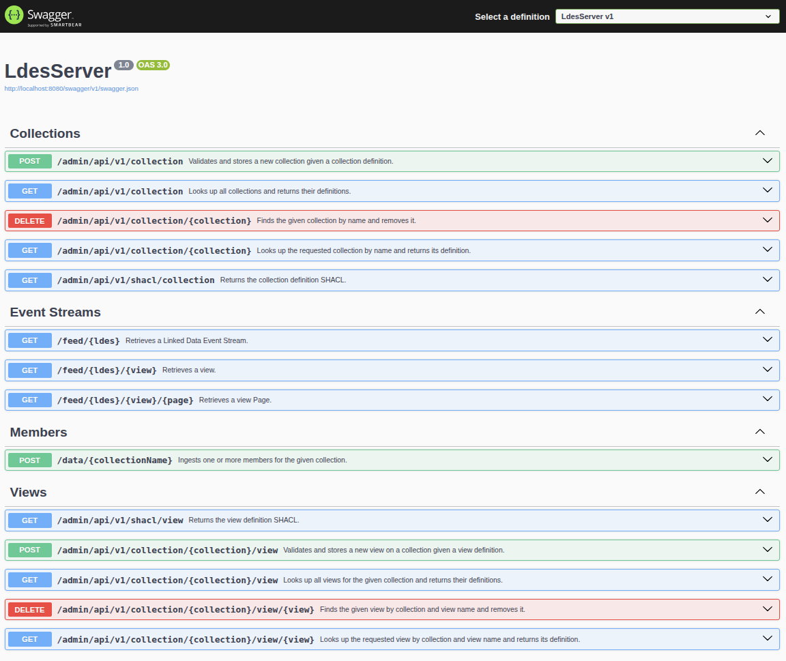

# LDES-Server.NET
Welcome to the **LDES-Server.NET** — a flexible, reliable, and scalable LDES server compliant with the latest [LDES specification](https://w3id.org/ldes/specification).

An **LDES (Linked Data Event Stream) server** is a fundamental component in any software architecture built on LDES technology. Its primary function is to manage one or more data collections—ranging from just a few items to millions—and to expose each collection in full compliance with the LDES specification, which builds upon the [TREE specification](https://w3id.org/tree/specification).

To learn what LDES is about and the motivation behind it, you can have a look at the [LDES step-by-step guide](https://github.com/rorlic/ldes-docs/blob/main/step-by-step/README.md). Focus especially on the first couple of steps as these will be important when you actually use the LDES-Server.NET system, referred to as the *LDES server* throughout the [LDES-Server.NET repository](https://github.com/rorlic/ldes-server.net).


## Table of Contents
* [Features](#features)
* [Installation](#installation)
* [Usage](#usage)
* [Documentation](#documentation)
* [License](#license)
* [Support](#support)


## Features
* Easy to setup and use
* Very flexible configuration
* Supports [TREE profile](https://treecg.github.io/specification/profile) specification
* Allows static & dynamic collection management
* Runs reliably with minimal resources
* Supports both horizontal & vertical scaling


## Installation
To install and experiment with an LDES server locally, you’ll need a Bash shell, a few open-source components, and some basic technical knowledge. After installing these prerequisites, you can launch the LDES server easily and try it with your data collections.

The LDES server is distributed as a [Docker](https://www.docker.com/) image, which provides a self-contained, containerized environment for running the server. 
To store data items and collections, the LDES server relies on a [PostgreSQL](https://www.postgresql.org/) database, which is provided as a Docker image on Docker Hub (see [here](https://hub.docker.com/_/postgres)).  
Because both containers must communicate, you’ll need a private network. 
You can use [Docker Compose](https://docs.docker.com/compose/) to define the necessary network and orchestrate both Docker images.

### Prerequisites
To run the commands below, you’ll first need access to a Bash shell and basic command-line (CLI) knowledge.
- **Windows:** Use the [Windows Subsystem for Linux (WSL)](https://learn.microsoft.com/en-us/windows/wsl/about). Docker also requires WSL (see later).
- **macOS:** The default Z shell (zsh) works, but minor syntax differences may occur. Using Bash is recommended.
- **Linux:** Bash is installed by default.

#### Editor
You can use any editor or development environment that you like to look at the source files. However, [Visual Studio Code](https://code.visualstudio.com/) and its open source alternative [VSCodium](https://vscodium.com/) offer a few nice features, such as previewing this and other markdown files as well as to manage [Docker](https://code.visualstudio.com/docs/containers/overview) and [Git](https://code.visualstudio.com/docs/sourcecontrol/overview) from within the editor.

#### Git
To download and use this repository you will need to install [Git](https://git-scm.com/downloads). After that, you can retrieve this repository locally using the following command:
```bash
git clone https://github.com/rorlic/ldes-server.net.git
```
This command will create a directory `ldes-server.net`, which you need to open in your editor to get started.

#### Docker
To install [Docker Desktop](https://www.docker.com/products/docker-desktop/) on  
- **Windows:** follow the [installation guide](https://docs.docker.com/desktop/install/windows-install/)  
- **macOS:** follow the [installation guide](https://docs.docker.com/desktop/install/mac-install/)  

If you're using **Linux**, you can install either:  
- the [Docker Desktop](https://docs.docker.com/desktop/install/linux-install/) edition, or  
- the [Docker Engine](https://docs.docker.com/engine/install/) (server edition)

### Getting the Image
> [!TIP]
> **Quick Start:** If you just want to try the LDES server immediately, skip to [Deploy](#deploy) to automatically download and launch everything with Docker Compose.

You can either build the LDES server Docker image from [source code](./src/) or use a prebuilt version from [Docker Hub](https://hub.docker.com). After acquiring the LDES server Docker and PostgreSQL images, you can easily deploy them locally for experimenting.

#### Build Image
You can build the LDES server Docker image from source using the following command:
```bash
sh ./build/build-image.sh
```
This command will build the Docker image from the source code in the [src](./src/) directory and tag the image as `latest`.

#### Use Prebuilt Image
Alternatively, to use and manually download the latest prebuilt image use the following command:
```bash
docker pull rorlic/ldes-server:latest
```
This command will download the latest LDES server Docker image from Docker Hub and store it locally for later use.  

> [!TIP]
> Multiple versions of the LDES server are available on Docker Hub, so if you need a specific version, you can replace the `latest` tag with the desired version tag. Please do not forget to use that tag in the Docker [compose configuration](./docker-compose.yml) file.

### Deploy
To deploy and run the LDES server locally, you need to provide some essential configuration shared by the LDES server and its PostgreSQL database. As this information may include sensitive data, it is recommended to pass it as environment variables within a Bash shell.

To deploy and run the LDES server along with its dependencies using Docker Compose:
```bash
export POSTGRES_USER=administrator
export POSTGRES_PWD=changeme
export POSTGRES_DB=development
docker compose up -d --wait
```
> [!WARNING]
> The credentials shown here are examples only. Use strong, unique passwords in production environments.
 
This command will pass the credentials and database name to both the LDES server and PostgreSQL, launch them in the background, and wait until both services are fully available.

> [!TIP] 
> The command above also starts a helper service, which provides a graphical interface to view the database content ([Adminer](https://www.adminer.org/en/)).  
> You can access this [Adminer GUI](http://localhost:8085/?pgsql=postgres&ns=public&db=development) in your web browser and need to enter the above credentials.


## Usage
To verify the installation was successful, access the [health status page](http://localhost:8080/health), the [metrics page](http://localhost:8080/metrics) or the Application Programming Interface (API) [documentation page](http://localhost:8080/swagger):



> [!NOTE]
> The API documentation is only available if the `ASPNETCORE_ENVIRONMENT` environment variable is set to `Development` (e.g. `ASPNETCORE_ENVIRONMENT=Development` in the Docker compose file or exported in the Bash shell).

To verify full functionality, you can run a Bash shell script that tests the LDES server's core features.  
To run this so-called smoke test, use the following command:
```bash
bash ./tests/smoke-test.sh
```
This will:
* create a data collection and retrieve its definition as well as the generated LDES
* create an additional view on the data collection
* add a data item to the data collection and wait for its availability in the views
* retrieve the default and additional views
* delete the data collection as well as its data item and views

> [!TIP]
> The above smoke test script uses the LDES server API to execute the above actions. It already gives a peek on how to interact with the LDES server.  
> For complete details on working with data collections and LDES, see the [Documentation](#documentation) section.
 
To terminate, use the following command:
```bash
docker compose down
```
This will stop and remove all systems, including the LDES server's database.


## Documentation
See the [documentation area](./docs/README.md).


## License
This Community Edition is licensed under the [European Public License](./LICENSE) (EUPL).  
For Enterprise Edition details, please [contact us](mailto:info@ldes-server.net).


## Support
If you need help with the LDES server, please reach out! 
You can report a bug, make a feature request or simply ask a question by opening an [issue](https://github.com/rorlic/ldes-server.net/issues) on GitHub.

Alternatively, you can [contact us](mailto:info@ldes-server.net) directly if you have a more urgent or private question.

Have fun exploring the LDES server!
