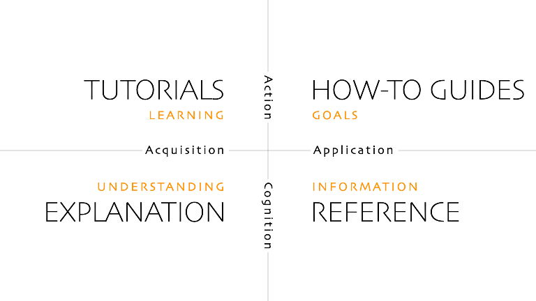

# LDES-Server.NET Documentation
In this documentation you can find [tutorials](./docs/tutorials/_index.md), [how-to](./docs/how-to/_index.md) guides, [reference](./docs/reference/_index.md) material and [discussions](./docs/discussions/_index.md).

The documentation is organized according to the [Diátaxis method](https://diataxis.fr/), which is a systematic approach to technical documentation authoring.  
This allows you to quickly find the relevant information based on your actual need:

